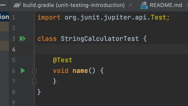

# Unit Testing Introduction

Project to introduce unit testing to people for the first time

## Description
This project is a calculator where you pass a comma separated list of numbers to the `add(inputString)` method.

e.g. 

**Input:** "5,10,20"

**Output:** 35 

## Getting Started

1. Open Project in intellij idea
2. Ensure you have set the Java version in the Project Structure otherwise you will get an error
3. When you go into the `StringCalculatorTest.java` you should see a green play button on the left

